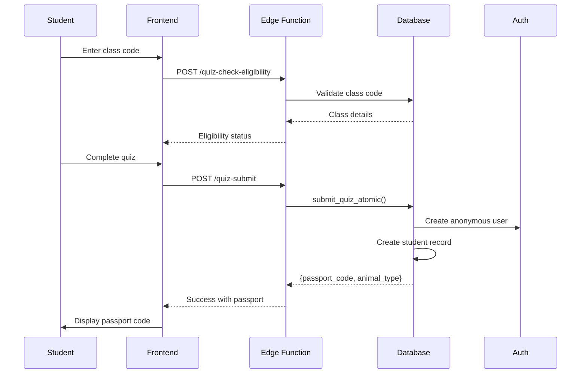
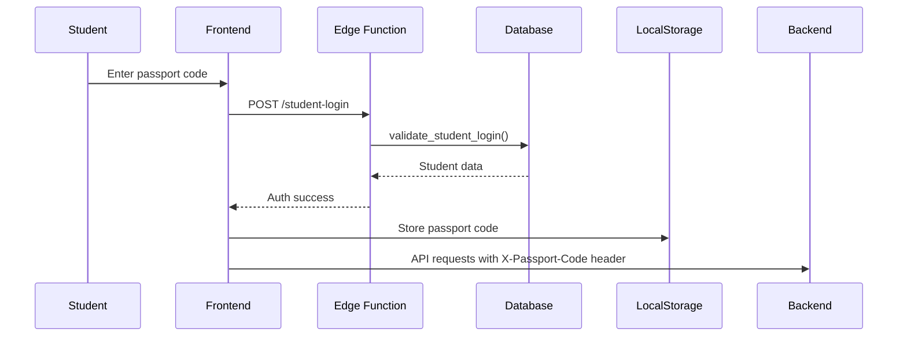
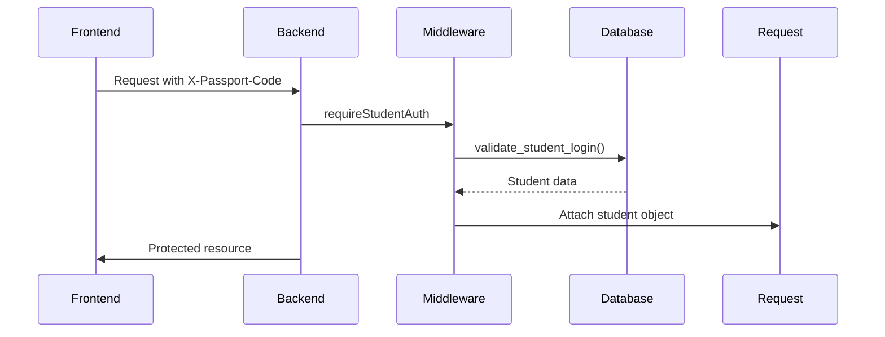

# Animal Genius Authentication System Documentation

## Table of Contents
1. [System Overview](#system-overview)
2. [Database Architecture](#database-architecture)
3. [Authentication Flow](#authentication-flow)
4. [API Endpoints](#api-endpoints)
5. [Security Considerations](#security-considerations)
6. [Troubleshooting Guide](#troubleshooting-guide)
7. [Future Maintenance](#future-maintenance)

---

## System Overview

The Animal Genius platform implements an **anonymous-first authentication system** where students can take educational quizzes without creating accounts upfront. This design prioritizes ease of access for young students while maintaining security and data integrity.

### Key Principles
1. **Anonymous First**: Students take quizzes BEFORE account creation
2. **Passport Codes**: Unique credentials (format: `XXX-XXX`) tied to specific class enrollments
3. **Animal-Based Identity**: Each student is assigned an animal type based on their quiz answers
4. **Class-Bound Authentication**: Students exist within the context of a specific class

### System Components
- **Supabase Auth**: Handles anonymous user creation
- **Edge Functions**: Serverless functions for quiz submission and student authentication
- **Express Backend**: API server with passport authentication middleware
- **React Frontend**: Student-facing interface with passport code login

---

## Database Architecture

### Core Tables

#### 1. `classes`
Represents educational classes created by teachers.
```sql
- id: UUID (primary key)
- class_code: VARCHAR(10) UNIQUE NOT NULL -- Format: "LT0-33B"
- teacher_id: UUID (references auth.users)
- class_name: VARCHAR(255)
- seat_limit: INTEGER -- Maximum students allowed
- is_active: BOOLEAN DEFAULT true
- expires_at: TIMESTAMP -- Optional expiration
- created_at/updated_at: TIMESTAMP
```

#### 2. `students`
Represents student records within classes.
```sql
- id: UUID (primary key)
- student_name: VARCHAR(100) -- Format: "FirstName LastInitial"
- class_id: UUID (references classes)
- passport_code: VARCHAR(7) UNIQUE NOT NULL -- Format: "XXX-XXX"
- user_id: UUID (references auth.users) -- Anonymous auth user
- animal_type: VARCHAR(50) -- Calculated from quiz
- animal_type_id: UUID (references animal_types) -- Optional
- genius_type_id: UUID (references genius_types) -- Optional
- school_year: VARCHAR(10) -- Grade level
- quiz_score: INTEGER
- created_at/updated_at: TIMESTAMP
```

#### 3. `profiles`
User profile information for both teachers and students.
```sql
- id: UUID (primary key, references auth.users)
- is_anonymous: BOOLEAN DEFAULT false
- created_at/updated_at: TIMESTAMP
```

#### 4. `animal_types` & `genius_types`
Reference tables for student categorization.
```sql
animal_types:
- id: UUID
- name: VARCHAR(50)
- code: VARCHAR(10) -- e.g., "OTT" for Otter
- description: TEXT

genius_types:
- id: UUID
- name: VARCHAR(50)
- code: VARCHAR(10)
- description: TEXT
```

### Database Functions

#### 1. `calculate_animal_type(quiz_answers JSONB) → TEXT`
Determines animal type based on quiz responses.
```sql
-- Logic:
-- Counts category responses (A=meerkat, B=panda, etc.)
-- Returns most frequent category
-- Tie-breaking: meerkat > panda > owl > beaver > elephant > otter > parrot > border_collie
```

#### 2. `generate_passport_code(animal_type TEXT) → TEXT`
Creates unique passport codes with animal prefixes.
```sql
-- Format: XXX-XXX where XXX is animal prefix
-- Prefixes:
-- MEE = Meerkat
-- PAN = Panda
-- OWL = Owl
-- BEA = Beaver
-- ELE = Elephant
-- OTT = Otter
-- PAR = Parrot
-- COL = Border Collie
-- STU = Default student

-- Suffix: 3 random chars from [A-Z0-9] excluding confusing characters
-- Retries up to 50 times to ensure uniqueness
```

#### 3. `submit_quiz_atomic(class_code, first_name, last_initial, grade, quiz_answers) → JSONB`
Atomic transaction for quiz submission and student creation.
```sql
-- Steps:
1. Validates class exists and is active
2. Checks seat limit
3. Prevents duplicate names in class
4. Calculates animal type
5. Creates anonymous auth user
6. Creates profile record
7. Creates student record with passport code
8. Returns success with passport code

-- Error handling:
- Invalid class code
- Class at capacity
- Duplicate student name
- Passport generation failure
```

#### 4. `validate_student_login(p_passport_code TEXT) → TABLE`
Optimized function returning all student data in one query.
```sql
-- Returns:
- student_id
- user_id
- class_id
- student_name
- school_year
- animal_type_code
- genius_type_code

-- Used by passport authentication middleware
```

### Row Level Security (RLS)

All tables have RLS enabled with the following policies:

1. **Service role bypass**: `service_role` can perform all operations
2. **Teacher access**: Teachers can manage their own classes and students
3. **Student access**: Students can only view their own data
4. **Anonymous restrictions**: Anonymous users cannot directly access tables

---

## Authentication Flow

### 1. Quiz Taking Flow (Anonymous → Authenticated)



### 2. Student Login Flow (Returning Student)



### 3. Authenticated Request Flow



---

## API Endpoints

### Edge Functions (Supabase)

#### 1. `/functions/v1/quiz-check-eligibility`
**Purpose**: Verify if a class code is valid for quiz taking
```typescript
POST /functions/v1/quiz-check-eligibility
Headers:
  Authorization: Bearer ${SUPABASE_ANON_KEY}
Body:
  { "classCode": "LT0-33B" }

Response:
  {
    "eligible": true,
    "className": "Ms. Smith's 5th Grade",
    "message": "You can take the quiz!"
  }
```

#### 2. `/functions/v1/quiz-submit`
**Purpose**: Submit quiz and create student
```typescript
POST /functions/v1/quiz-submit
Headers:
  Authorization: Bearer ${SUPABASE_ANON_KEY}
Body:
  {
    "classCode": "LT0-33B",
    "firstName": "Emma",
    "lastInitial": "W",
    "grade": "5th",
    "answers": { "q1": "A", "q2": "B", ... }
  }

Response:
  {
    "success": true,
    "passportCode": "OTT-X9K",
    "animalType": "otter",
    "studentId": "uuid"
  }
```

#### 3. `/functions/v1/student-login`
**Purpose**: Validate passport code
```typescript
POST /functions/v1/student-login
Headers:
  Authorization: Bearer ${SUPABASE_ANON_KEY}
Body:
  { "passportCode": "OTT-X9K" }

Response:
  {
    "success": true,
    "student": {
      "id": "uuid",
      "name": "Emma W",
      "classId": "uuid",
      "animalType": "otter"
    }
  }
```

### Backend API (Express)

#### Protected Endpoints
All require `X-Passport-Code` header:

- `GET /api/student-passport/profile` - Get student profile
- `GET /api/student-passport/class-info` - Get class details
- `GET /api/student-passport/quiz-results` - Get quiz history
- `POST /api/student-passport/update-avatar` - Update avatar

#### Middleware Functions
```typescript
// Required authentication
requireStudentAuth(req, res, next)

// Optional authentication
optionalStudentAuth(req, res, next)

// Class membership validation
requireStudentInClass(req, res, next)
```

---

## Security Considerations

### 1. Critical Security Requirements

#### Unique Passport Codes
```sql
-- CRITICAL: Passport codes MUST be unique
CREATE UNIQUE INDEX idx_students_passport_code ON students(passport_code);

-- Format validation
ALTER TABLE students 
ADD CONSTRAINT chk_passport_code_format 
CHECK (passport_code ~ '^[A-Z]{3}-[A-Z0-9]{3}$');
```

#### No Weak Fallbacks
The `generate_passport_code` function MUST fail rather than use predictable codes:
```sql
IF v_attempt >= v_max_attempts THEN
  RAISE EXCEPTION 'Could not generate unique passport code';
END IF;
```

#### SECURITY DEFINER Functions
All database functions use `SECURITY DEFINER` with explicit search paths:
```sql
CREATE FUNCTION ... SECURITY DEFINER SET search_path = pg_catalog, public;
```

### 2. Access Control

#### Service Role Permissions
Service role bypasses RLS but needs explicit GRANT permissions:
```sql
GRANT USAGE ON SCHEMA public TO service_role;
GRANT SELECT, INSERT, UPDATE, DELETE ON ALL TABLES IN SCHEMA public TO service_role;
GRANT USAGE ON ALL SEQUENCES IN SCHEMA public TO service_role;
GRANT EXECUTE ON ALL FUNCTIONS IN SCHEMA public TO service_role;
```

#### Rate Limiting
Edge Functions implement rate limiting via Upstash Redis:
- Quiz submissions: 5 per hour per IP
- Login attempts: 10 per hour per passport code

### 3. Data Protection

- Passport codes are case-insensitive (stored uppercase)
- No passwords - passport codes are the sole credential
- Anonymous users have restricted email format: `{uuid}@anonymous.local`
- Student names are limited to first name + last initial

---

## Troubleshooting Guide

### Common Issues

#### 1. "Permission denied for table X"
**Cause**: Service role missing GRANT permissions
**Fix**: Run the GRANT permissions script:
```sql
-- /scripts/GRANT-PERMISSIONS-FIX.sql
GRANT ALL PRIVILEGES ON ALL TABLES IN SCHEMA public TO service_role;
```

#### 2. "Column reference 'class_code' is ambiguous"
**Cause**: JOIN queries without table prefixes
**Fix**: Always use table aliases in functions:
```sql
WHERE c.class_code = ... -- NOT just class_code
```

#### 3. "INVALID_CLASS" error for valid class
**Cause**: Class expired or inactive
**Fix**: Check class status:
```sql
SELECT * FROM classes 
WHERE class_code = 'XXX' 
AND is_active = true 
AND (expires_at IS NULL OR expires_at > NOW());
```

#### 4. Edge Function deployment failures
**Cause**: Missing environment variables
**Fix**: Set all required secrets:
```bash
supabase secrets set REDIS_URL="redis://..."
supabase functions deploy quiz-submit
```

### Debugging Tools

#### 1. Test Passport Authentication
```bash
curl -X POST http://localhost:5001/api/student-passport/validate \
  -H "Content-Type: application/json" \
  -d '{"passportCode": "OTT-X9K"}'
```

#### 2. Check Student Data
```sql
-- Find student by passport
SELECT s.*, c.class_code, c.class_name 
FROM students s 
JOIN classes c ON s.class_id = c.id 
WHERE s.passport_code = 'OTT-X9K';
```

#### 3. Monitor Auth Performance
Check server logs for auth performance metrics:
```
Auth Performance Summary: {
  totalRequests: 100,
  successRate: '95%',
  avgResponseTime: '45ms'
}
```

---

## Future Maintenance

### 1. Adding New Animal Types

1. Update `calculate_animal_type` function:
```sql
WHEN most_frequent = 'I' THEN 'new_animal'
```

2. Update `generate_passport_code` prefixes:
```sql
WHEN animal_type = 'new_animal' THEN 'NEW'
```

3. Add to `animal_types` table:
```sql
INSERT INTO animal_types (name, code, description)
VALUES ('New Animal', 'NEW', 'Description...');
```

### 2. Migrating Anonymous to Full Accounts

Future feature to convert anonymous students to full accounts:
```sql
-- Planned function
CREATE FUNCTION convert_anonymous_to_full(
  p_student_id UUID,
  p_email TEXT,
  p_password TEXT
) RETURNS BOOLEAN;
```

### 3. Performance Optimization

Monitor these queries for optimization needs:
- `validate_student_login` - Currently single query optimized
- Class student counts for seat limit checks
- Passport code generation collision rate

### 4. Backup Considerations

Critical data to backup:
- Student passport codes (unique credentials)
- Class-student relationships
- Quiz scores and animal type assignments

### 5. Security Audits

Regular security checks:
1. Verify passport code uniqueness constraint
2. Review GRANT permissions
3. Check for orphaned anonymous auth users
4. Monitor failed login attempts
5. Validate rate limiting effectiveness

---

## Appendix: Environment Variables

### Backend (.env)
```env
DATABASE_URL=postgresql://...
SUPABASE_URL=https://...
SUPABASE_ANON_KEY=eyJ...
SUPABASE_SERVICE_ROLE_KEY=eyJ...
```

### Frontend (.env.local)
```env
VITE_API_URL=http://localhost:5001
VITE_SUPABASE_URL=https://...
VITE_SUPABASE_ANON_KEY=eyJ...
```

### Edge Functions (Supabase Secrets)
```bash
REDIS_URL=redis://...
SUPABASE_SERVICE_ROLE_KEY=eyJ...
SUPABASE_URL=https://...
```

---

## Quick Reference

### Passport Code Format
- Pattern: `XXX-XXX`
- Example: `OTT-X9K`
- Case insensitive (stored uppercase)
- Animal prefixes: MEE, PAN, OWL, BEA, ELE, OTT, PAR, COL

### Key Functions
- `submit_quiz_atomic()` - Create student from quiz
- `validate_student_login()` - Verify passport code
- `generate_passport_code()` - Create unique codes
- `calculate_animal_type()` - Determine animal from quiz

### Critical Files
- `/supabase/migrations/20250111_anonymous_auth_final.sql` - Core system
- `/supabase/migrations/20250112_security_fixes.sql` - Security patches
- `/server/middleware/passport-auth.ts` - Auth middleware
- `/supabase/functions/quiz-submit/index.ts` - Quiz submission

This documentation represents the complete anonymous-first authentication system as of January 2025. Always refer to the latest migration files for the current database state.